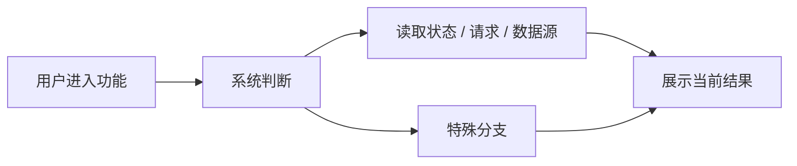
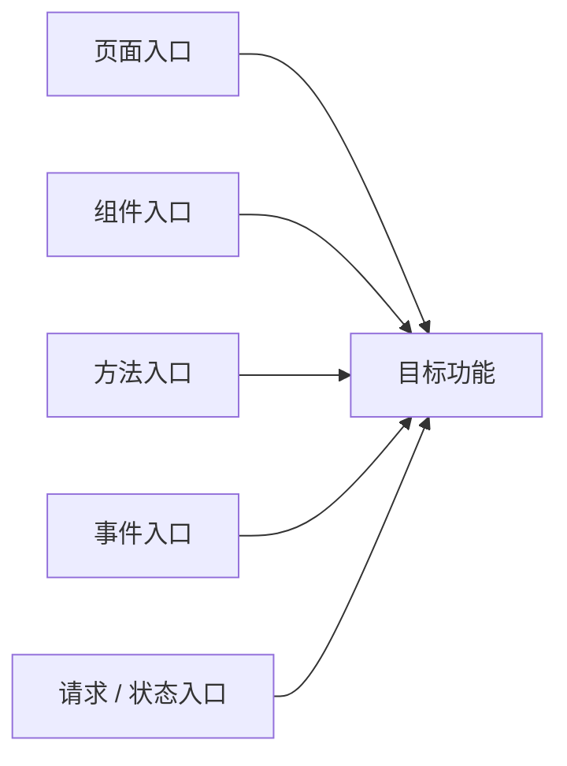
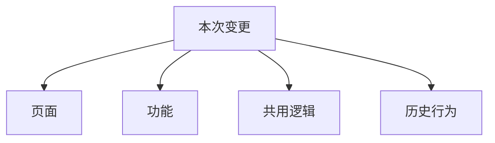

# Exploration: Feature Change (explorationFeatureChange)

## 概述 (summary)
请用 3～5 行说明：
- 当前功能现在是怎么工作的
- 需求想改什么
- 最可能需要改哪些地方
- 当前最大的风险是什么

## 需求摘要 (requirementSummary)
整理这次变更需求：
- 具体要改什么
- 是改规则、改流程，还是改展示
- 明确不改哪些内容
- 当前已知限制有哪些

## 当前行为 (currentBehavior)
优先用 Mermaid 流程图说明这个功能现在的实际行为：

补充说明：
- 用户现在看到什么
- 系统现在怎么判断
- 当前依赖哪些状态、请求或数据源
- 当前有哪些特殊分支

## 本次变更目标 (changeGoals)
明确这次想改的点：
- 改判断条件
- 改请求方式
- 改状态联动
- 改页面展示
- 改文案 / 配置逻辑

## 入口点 (entryPoints)
优先用 Mermaid 流程图列出与本次变更最相关的入口：

## 关键逻辑链路 (keyLogicFlow)
优先用 Mermaid 流程图列出与这次变更最相关的逻辑路径：

尽量只写最关键的 1～3 条链路。

## 相关模块 (relatedModules)
列出本次修改最相关的模块，并说明其作用：
- 模块 A：作用
- 模块 B：作用
- 模块 C：作用

## 状态与依赖分析 (stateAndDependencyAnalysis)
列出本次变更依赖的内容：
- 哪些状态
- 哪些接口
- 哪些链上数据
- 哪些配置项
- 哪些共享逻辑

## 影响面 (impactScope)
优先用 Mermaid 流程图列出本次变更理论上可能影响的范围：

## 当前逻辑为什么可能不能随便改 (currentLogicConstraints)
分析当前逻辑可能存在的特殊原因：
- 历史兼容
- 多链差异
- 特殊用户路径
- 权限限制
- 防回归考虑

## 潜在风险 (potentialRisks)
- 越界修改风险
- 回归风险
- 状态联动风险
- 用户体验风险
- 兼容性风险

## 待确认问题 (openQuestions)
- 问题 1
- 问题 2
- 问题 3

## 当前探索结论 (currentExplorationConclusion)
三选一：
- 可以进入 Planner
- 可以进入 Planner，但需要保留 open questions
- 暂时不能进入 Planner，必须先补充上下文
