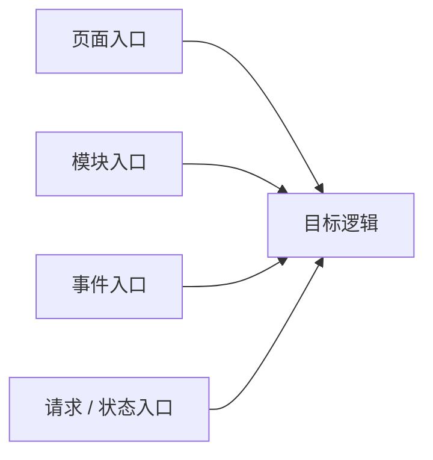
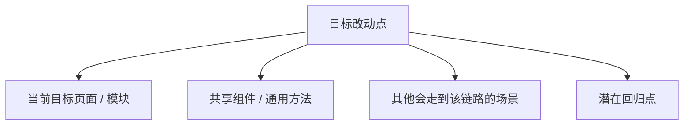

# Exploration: Impact Analysis for Unfamiliar Project (explorationImpactAnalysisForUnfamiliarProject)

## 概述 (summary)
请用 3～5 行说明：
- 这次想改什么
- 当前对项目和模块的熟悉程度如何
- 当前最不确定的地方是什么
- 为什么这次改动存在提交风险

## 目标改动点 (targetChanges)
明确写清楚：
- 这次想改的具体点是什么
- 目标行为是什么
- 当前代码中大概对应哪一块逻辑

## 入口点 (entryPoints)
优先用 Mermaid 流程图列出本次改动最相关的入口：

## 关键调用链 (keyCallChains)
优先用 Mermaid 流程图列出当前已识别出的调用链：

要求尽量写清：
- 谁调用谁
- 在哪一层
- 最终影响到哪里

## 依赖项 (dependencies)
列出本次改动依赖的内容：
- 状态
- 配置
- 接口
- 链上数据
- 上下文对象
- feature flag
- 环境变量

## 当前逻辑可能存在的特殊原因 (currentLogicSpecialReasons)
分析为什么当前逻辑不能直接按表面理解去改：
- 历史兼容
- 多链差异
- 多入口复用
- 特殊分支
- 失败回退逻辑
- 权限限制

## 影响面分析 (impactAnalysis)
优先用 Mermaid 流程图列出这次改动理论上可能影响的范围：

## 当前信心缺口 (currentConfidenceGaps)
明确写出自己现在还不确定的地方：
- 不确定点 1
- 不确定点 2
- 不确定点 3

## 提交前必须再次确认的点 (preSubmissionChecks)
列出提交前一定要弄清楚的内容：
- 这个入口是否唯一
- 是否还有其他调用方
- 当前逻辑是否承担历史兼容职责
- 这次改动是否会影响其他页面 / 链路

## 当前探索结论 (currentExplorationConclusion)
三选一：
- 可以进入 Planner
- 可以进入 Planner，但必须保留较高风险提示
- 暂时不能进入 Planner，必须先补充调用链和影响面
