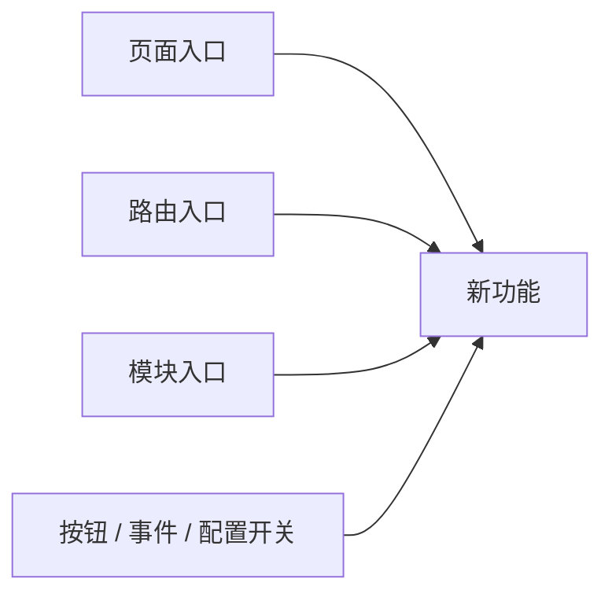
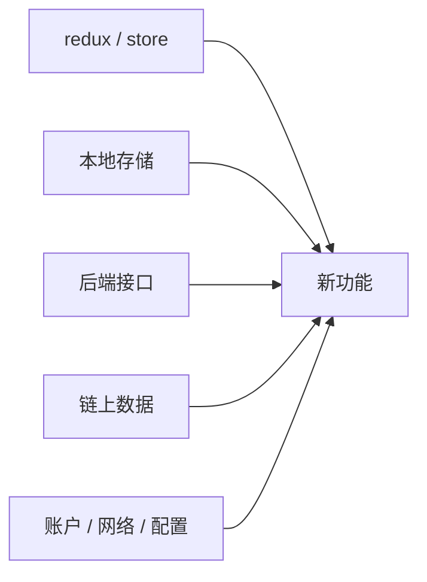
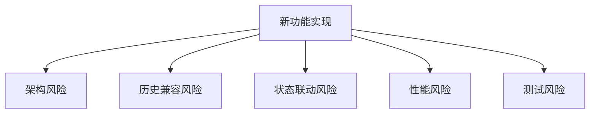

# Exploration: New Feature (explorationNewFeature)

## 概述 (summary)
请用 3～5 行说明：
- 这个需求要做什么
- 这个功能服务谁
- 当前项目里是否已有类似能力
- 当前最大的未知点是什么

## 需求摘要 (requirementSummary)
整理原始需求，回答：
- 功能目标是什么
- 用户最终能得到什么
- 明确不包含哪些内容
- 当前已知限制有哪些

## 现有可复用能力 (reusableCapabilities)
列出项目内可能可以复用的能力：
- 已有页面
- 已有组件
- 已有 hooks / utils / service
- 已有类似业务逻辑
- 已有状态管理逻辑

## 可能的入口点 (possibleEntryPoints)
优先用 Mermaid 流程图列出这个功能可能从哪里接入：

## 相关模块 (relatedModules)
列出与本功能最相关的模块，并说明它们当前作用：
- 模块 A：作用
- 模块 B：作用
- 模块 C：作用

## 数据与状态依赖 (dataAndStateDependencies)
优先用 Mermaid 流程图列出这个功能可能依赖的内容：

## 外部参考资料 (externalReferences)
如果本功能依赖外部知识，请列出：
- 协议
- 产品文档
- 第三方实现
- 历史需求
- 参考页面

## 潜在风险 (potentialRisks)
优先用 Mermaid 流程图展示风险扩散关系，再补充文字说明：

## 待确认问题 (openQuestions)
列出当前不能擅自假设的问题：
- 问题 1
- 问题 2
- 问题 3

## 当前探索结论 (currentExplorationConclusion)
三选一：
- 可以进入 Planner
- 可以进入 Planner，但需要保留 open questions
- 暂时不能进入 Planner，必须先补充上下文
