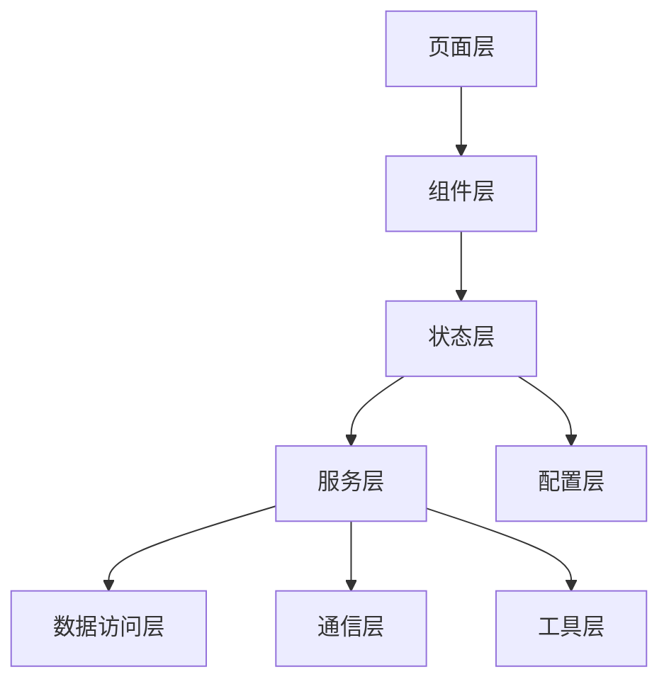
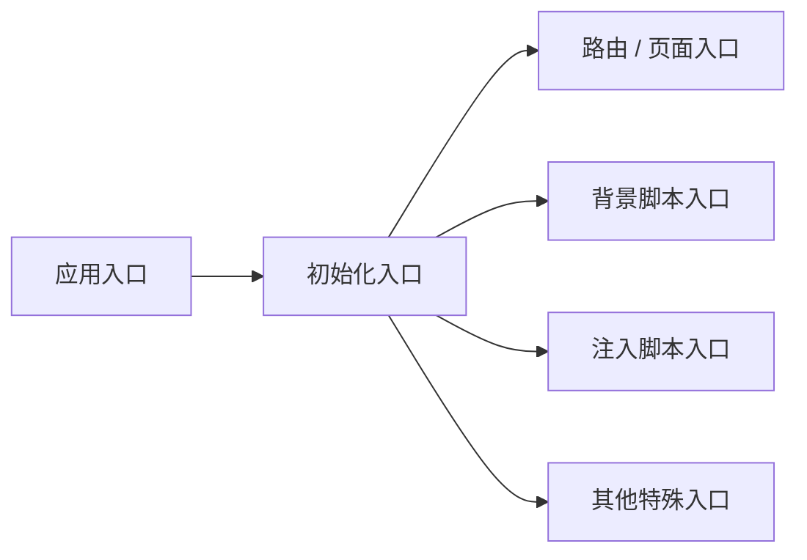
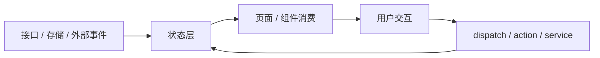
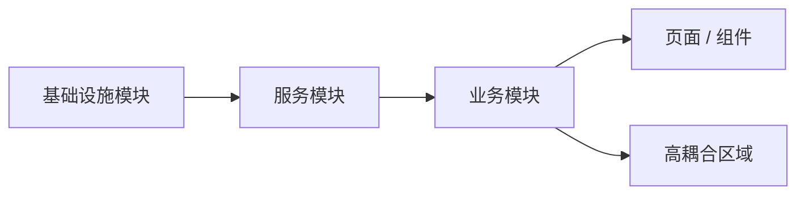

# Exploration: Unfamiliar Project Architecture (explorationUnfamiliarProjectArchitecture)

## 概述 (summary)
请用 3～5 行说明：
- 这个项目大概是做什么的
- 当前项目的技术栈和运行形态是什么
- 你对它的第一印象是什么
- 当前最大的理解障碍是什么

## 项目目标与主要能力 (projectGoalsAndCoreCapabilities)
根据代码和文档，概括：
- 这个项目的主要目标
- 它提供哪些核心能力
- 面向谁使用
- 是否存在多端 / 多上下文 / 多运行环境

## 目录结构总览 (directoryStructureOverview)
列出核心目录及其职责：
- 目录 A：作用
- 目录 B：作用
- 目录 C：作用

尽量只保留关键目录，不要把所有目录都抄一遍。

## 架构分层 (architectureLayers)
优先用 Mermaid 流程图概括项目的主要分层：

说明每一层大概承担什么职责。

## 主要入口 (mainEntryPoints)
优先用 Mermaid 流程图列出项目的主要入口：

## 核心模块 (coreModules)
列出最重要的模块，并说明它们在整体中的地位：
- 模块 A：职责
- 模块 B：职责
- 模块 C：职责

## 状态与数据流 (stateAndDataFlow)
优先用 Mermaid 流程图说明项目的主要状态流 / 数据流：

补充说明：
- 状态从哪里来
- 如何更新
- 页面如何消费状态
- 是否有异步请求层
- 是否有共享缓存 / 本地存储

## 模块之间的关系 (moduleRelationships)
优先用 Mermaid 流程图说明主要模块之间如何连接：

补充说明：
- 谁依赖谁
- 谁调用谁
- 哪些模块是基础设施
- 哪些模块是业务层
- 哪些模块是高耦合区域

## 特殊架构点 (specialArchitecturePoints)
列出这个项目中不符合普通 Web 项目的特殊点：
- 多运行环境
- 插件上下文
- iframe / 注入
- provider / message channel
- 权限系统
- 链上交互
- 其他特殊机制

## 高风险区域 (highRiskAreas)
列出阅读后判断最容易出问题、最难修改的区域：
- 区域 1：原因
- 区域 2：原因
- 区域 3：原因

## 建议阅读路径 (recommendedReadingPath)
如果后续继续深入这个项目，优先用 Mermaid 流程图表达建议阅读顺序：

## 当前探索结论 (currentExplorationConclusion)
三选一：
- 已具备整体理解，可以进入具体功能探索
- 已有整体轮廓，但还需要补充关键模块阅读
- 当前理解仍不够，建议先继续补目录和入口层面的阅读
