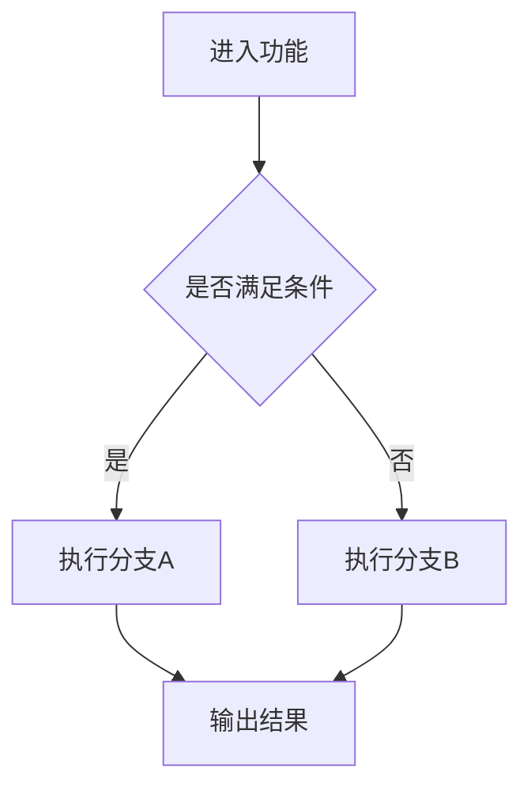

# Feature Spec (featureSpec)

## 概述 (summary)
请用 3～5 行总结：
- 这次功能/改动的核心目标是什么
- 它解决的主要问题是什么
- 影响范围大概是什么
- 当前最需要注意的约束是什么

## 背景 (background)
说明为什么要做这次功能/改动：
- 需求背景是什么
- 当前存在什么问题
- 为什么现在要处理
- 如果不做，会有什么影响

## 功能目标 (featureGoals)
明确说明这次要实现什么：
- 用户最终获得什么能力
- 系统新增了什么行为
- 系统改变了什么行为
- 哪些结果是这次交付必须达成的

要求：
- 尽量写具体
- 不要只写抽象目标
- 不要混入实现细节

## 非目标 (nonGoals)
明确说明这次**不做什么**：
- 不包含哪些页面
- 不处理哪些逻辑
- 不解决哪些历史问题
- 不顺手重构哪些区域
- 不扩展到哪些模块

这一节非常重要，用来防止 Builder 越界。

## 当前行为 (currentBehavior)
如果是已有功能修改，请说明：
- 当前功能现在怎么工作
- 当前主流程是什么
- 当前依赖哪些状态、请求或配置
- 当前已知特殊行为有哪些

如果是新功能，可以说明：
- 当前项目中是否已有类似能力
- 当前没有这个能力会带来什么问题
- 当前有哪些可以复用的逻辑

## 目标行为 (targetBehavior)
说明这次改完后，系统应该如何工作：
- 用户看到什么变化
- 系统内部行为有什么变化
- 哪些行为会保持不变
- 新旧行为边界是什么
- 哪些条件下走不同分支

## 流程说明 (flowDescription)
用顺序方式说明主流程：

1. 第一步发生什么
2. 第二步发生什么
3. 第三步发生什么
4. 如有分支，说明分支条件
5. 最终结果是什么

要求：
- 只保留主流程
- 不要写太多实现细节
- 如果流程很复杂，配合流程图说明

## 流程图 (flowchart)
请优先使用 mermaid 描述主流程。

要求：
- 只画最关键路径
- 一张图只表达一个重点
- 节点不要过多，避免过度复杂

示例格式：

