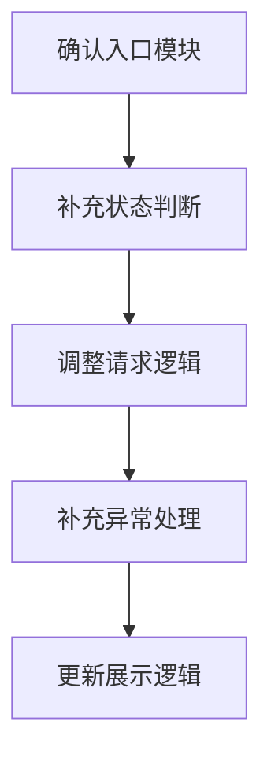

# Implementation Plan (implementationPlan)

## 概述 (summary)
请用 3～5 行总结：

- 这次实现的总体思路是什么
- 计划拆成几步完成
- 最关键的风险点在哪
- 哪一步最需要注意
- 当前是否存在仍未完全确认的问题

---

## 输入依据 (inputBasis)
说明本计划基于哪些输入生成：

- Feature Spec
- Exploration
- 相关架构规范
- 代码规范
- 历史实现参考
- 其他补充信息

如果存在缺失信息，也要明确写出：

- 缺失信息 1
- 缺失信息 2

---

## 实现目标 (implementationGoals)
从实现角度说明，这次开发最终要落地什么：

- 需要新增什么
- 需要修改什么
- 需要保持什么不变
- 最终交付结果应该是什么状态

要求：
- 只写实现层目标
- 不重复抄 Feature Spec
- 不写过于抽象的表述

---

## 实现策略 (implementationStrategy)
概括这次打算怎么实现：

- 是在现有逻辑上扩展
- 是增加判断分支
- 是替换请求来源
- 是拆出新函数 / 新模块
- 是新增状态 / 调整状态联动
- 是补保护逻辑 / fallback
- 是局部改造而不是整体重构

这一节只写方向，不写具体代码。

---

## 实施流程图 (implementationFlowchart)
请优先使用 mermaid 描述本次实现步骤、模块依赖或改动顺序。

要求：

- 图只表达实施顺序或模块关系
- 不要重复业务流程图
- 控制复杂度
- 只画最关键路径

示例格式：

---

## Todolist (todoList)
把实施任务拆成可执行、可勾选的 todo 列表。

要求：

- 每一项都必须是具体动作，不写空泛描述
- 优先按实施顺序排列
- 一个 todo 只描述一件事
- 能独立验证的动作尽量单独拆出
- 如果存在前置依赖，要在文案中体现

示例格式：

- [ ] 确认目标入口文件和需要修改的模块边界
- [ ] 补充或调整状态判断逻辑
- [ ] 修改请求 / 数据处理逻辑
- [ ] 更新页面展示或交互行为
- [ ] 补充异常处理、fallback 或兼容逻辑
- [ ] 添加或更新测试
- [ ] 完成自检并确认影响面
